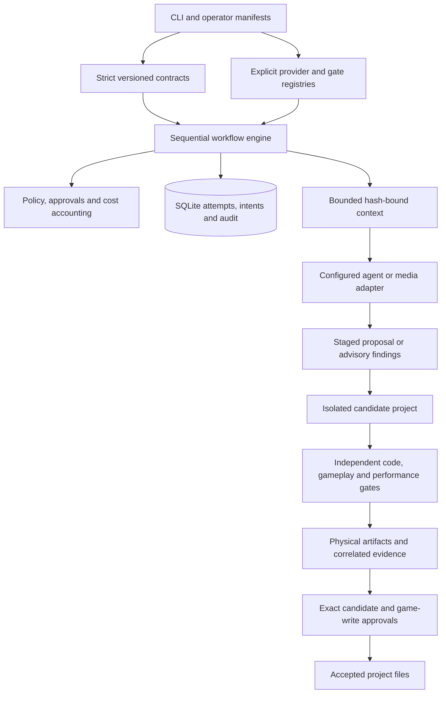

# Factory architecture

Factory is development-time tooling for an ordinary game project. The generated
game does not depend on Python, the Factory database, an AI provider, or the
development harness at runtime. Historical milestone reports describe earlier
qualification; the current scope is recorded in the
[master completion plan](../work-plan-master-completion.md).

## Responsibilities

`core/domain` defines models, versioned wire contracts, state machines and DAG
checks. It does not import the CLI, database, engine executables or provider
packages. `agents` builds explicit context, routes declared capabilities and
validates proposals. A Director validates claims; it cannot spend, run code,
write game files, approve work, or mark a workflow complete.

`workflows` coordinates the existing engine, registered task handlers, policy,
durable attempts, provider intents and artifact repositories. `adapters` contains
SQLite, Godot, Blender, project discovery, Codex, Meshy and hosted-media details.
The CLI composes these adapters explicitly and maps project policy into the same
engine for initial execution and resume. There is no remote plugin discovery or
model-selected executable loading.

## Workflow and approval lifecycle

Tasks form an acyclic dependency graph. A bounded manifest declares each task's
family, selected agent and executor, inputs, tools, cost ceiling, exact output
paths and required gates. Missing capabilities block preflight. A family name or
a provider success message does not implement a production task.

Before dispatch the engine checks policy and claims an execution attempt.
External provider tasks bind their configuration, model, prompt, source hashes
and operation fingerprint into approval and durable invocation intent. An
interrupted submission is queried only when its adapter supports safe recovery
with a known operation ID. Otherwise it remains blocked for audited
reconciliation; a retry is not permission to repeat a possibly charged call.

Providers return untrusted staged content or advisory observations. The Director
checks proposal identity, scope, capabilities and hashes. Trusted local gates
then parse or execute an isolated, hash-bound candidate and retain physical
logs, receipts, captures and observations. Code execution approval concerns the
actual candidate. Final gates evaluate the combined candidate rather than
assuming independently valid fragments form a valid product.

Visual analysis is advisory. Screenshot, reference and art-bible hashes bind a
review to its exact inputs. A human visual decision cannot override a failed
deterministic gate. Applying game files requires a separate approval tied to the
candidate, gate reports and destination baselines. Publication uses durable
recovery records and exclusive file creation; unexpected operator edits are
preserved and block recovery.

## Persistence, cost and filesystem boundaries

An initialized project keeps its configuration, discovery snapshot, database,
artifacts, operation intents and locks under `.gamefactory`. SQLite migrations
are additive; transactions protect claims, approval compare-and-set operations,
cost reservations and audit entries. Previous failed or uncertain attempts remain
part of the evidence history.

Paths are checked against the selected root, including original symlink and
Windows junction components. Bounded descriptor reads, source manifests and
output limits constrain context, snapshots and artifacts. Credentials are
referenced by environment-variable name; their values are not configuration,
prompt, artifact or audit content.

Unknown provider charges remain unknown and retain their reservation. Known
charges are recorded in their actual currency and unit; no implicit conversion
or fabricated zero charge is permitted. An already incurred overage is an audit
and accounting fact, not authorization for more spending.

Subprocesses use fixed argument arrays, `shell=False`, explicit working
directories, minimal environments, timeouts and bounded redacted output. These
controls are not an operating-system sandbox for hostile executable code.
Operator process providers therefore require explicit process and network
permissions. No automatic expensive fallback is enabled.

## Godot and release

The development harness runs only declared scene, entity, input, state, capture
and metric actions in a staged project. Python evaluates observations against
the independent scenario and performance budget. Missing or unsupported metrics
fail a required budget; headless execution cannot establish rendered quality.
Performance collection uses measured real time rather than treating fixed-FPS
simulation as a performance benchmark.

Native export uses a validated preset and a fresh staged source snapshot. The
result binds the completed execution, executable, source, exit status, logs and
every export file hash. Release approval selects that exact completed build.
Release records operator approval and a manifest; it does not upload or publish
to a store. Scratch harnesses and Factory state are excluded from export staging.

See [integration status](../integrations/status.md),
[the master guide](../guides/master-factory.md) and the [ADRs](../adr/).