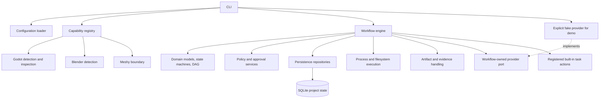
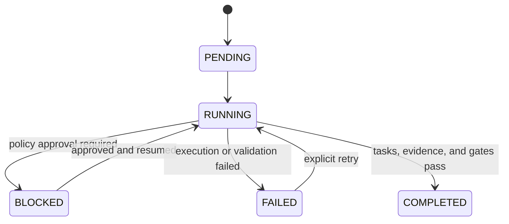
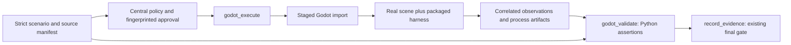

# Architecture through V0.2

Factory is development-time tooling. The game project is the target being inspected and edited; the game does not depend on the Factory at runtime.

The domain package has no imports from the CLI, database, Godot, Blender, or provider packages. V0.1's `WorkflowEngine` currently composes concrete repository adapters around SQLite directly; it is the orchestration boundary, while the model and state-machine code stays persistence-independent. Adapters own the operating-system and provider-specific details.

## Workflow and evidence lifecycle

Tasks form a validated directed acyclic graph. The sequential runner selects tasks whose prerequisites completed, checks policy, and claims a new execution attempt before dispatch. A local result validator checks the task result; artifact-producing tasks register outputs and hashes. Evidence and quality-gate decisions are persisted against task and execution IDs. Workflow completion requires the configured final evidence gate.

Approval requests bind the operation inputs by fingerprint. `approve` or `reject` records actor, decision, comment, and an audit event with a compare-and-set operation. Approval alone does not resume work; an explicit `resume` rechecks policy and continues from persisted task state. An uncertain paid call is blocked for reconciliation instead of being silently repeated.

## Persistence and filesystem boundary

Each initialized project stores its contract at `.gamefactory/factory.yml`, read-only discovery snapshot at `.gamefactory/discovery.json`, and SQLite database, migrations, and locks beneath `.gamefactory/state` and `.gamefactory/locks`. Repositories translate domain records to SQLite. Migrations are versioned. Artifacts live below Factory-managed project storage and are tracked separately by relative path, content hash, size, producer, workflow, and task. SQLite transactions protect claims, decisions, and audit updates; OS locks prevent concurrent local runners for one workflow.

Before initialization or state access, managed directories and database/config paths are resolved against the selected project root. A path that escapes through traversal, a symlink, or a Windows junction is rejected. Existing game files are inspected read-only during initialization and are not reorganized.

## Local execution and security

Subprocess execution uses argument arrays and `shell=False`, explicit working directories, timeouts, and redacted output. There is no generic command string supplied by AI. V0.1 demonstrator workflows use bounded built-in task types. Paid-classified fake generation cannot be dispatched before approval. The Meshy adapter rejects generation because a production transport is not implemented.

Configuration layers are defaults, user config under the platform user config directory, project `.gamefactory/factory.yml`, and command-line overrides for executable discovery. Project config requires schema version `0.1.0`, rejects unknown or secret-named fields, and validates finite nonnegative budget limits. Credentials must be supplied through environment variables to future adapters; V0.1 does not send them externally.

## Lifecycle and extension limits

The Factory initializes local project state, creates and runs demonstrator workflows, persists attempts, pauses for approval, resumes or retries, and exposes status/inspection. V0.2 also launches bounded Godot verification in an attempt-owned staged project. It does not create projects, plan natural-language work, automate Blender, generate real assets, or host plugins from third parties. See [integration status](../integrations/status.md) and the [deferred boundaries](../requirements/future-boundaries.md).

`core/domain` contains plain Python models, state machines, and DAG checks. `workflows` coordinates the state machine and policy checks and owns the provider port in `ports.py`. Built-in task actions are registered in `builtin_tasks.py`; extensions use `handlers.py`. `adapters/persistence` owns SQLite and versioned migrations. `adapters/engines` and `adapters/dcc` isolate local tool detection. `adapters/external` implements provider boundaries; its legacy `base` module re-exports the inward contracts for compatibility. The CLI explicitly injects the fake provider only for demonstrator workflows.

V0.1 execution is sequential. An approval pauses a task and persists the request. Resume reloads durable state. Failed attempts remain in execution history. The invocation ledger records durable intent immediately before calling any provider implementation; a crash between the record and call can conservatively require reconciliation. It is not an exactly-once guarantee, and no production paid transport is available.

Handlers are trusted local Python extensions, not a sandbox for hostile executable code. Their returned claims remain untrusted: the engine validates result shape, artifact ownership, physical files, and hashes before completion. Project policy settings are explicitly mapped into the policy engine by the CLI composition function.

Current real tool support includes Godot detection, metadata inspection and the bounded headless verification pipeline. Blender does not modify assets. Meshy does not call a service. See [integration status](../integrations/status.md) and [ADRs](../adr/).

## V0.2 Godot verification boundary

The runtime request carries actions and sample ticks; expected values stay outside
the harness. Handler metadata exposes process/write effects to the central policy.
Attempt launch intent and terminal receipts support conservative recovery without
changing the domain's state machines or SQLite schema. Interrupted ownership is
not inferred from PID or a released lock. See [ADR 0005](../adr/0005-godot-staging-and-independent-oracle.md).
