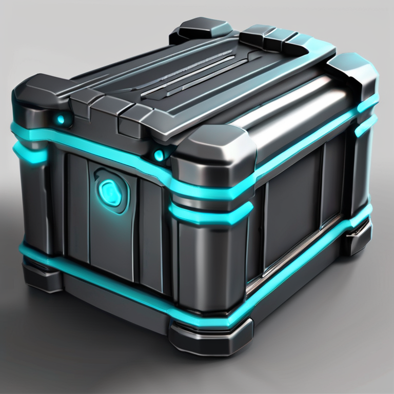

# Energy crate concept — human review pending

- Asset: `prop_energy_crate_01`, intended first revision, static prop.
- Target dimensions: 1.2 × 1.0 × 1.0 m; +Y up, -Z front, bottom-center origin.
- Budgets: LOD0 ≤20,000 triangles, LOD1 required, ≤2 materials, textures ≤2048.
- Provider: local `ai-assets`, SDXL base. Cost classification: LOCAL; no paid API.
- Job: `e58caab2-5785-4ff0-ae9e-04099e05397e`; seed 40402; 768×768 PNG.
- SHA-256: `be3e9cf1a190fdfb31be85580508f73397217f399c553bd34c18924adc30e25d`.
- Full generation provenance: [local-sdxl-provenance.json](local-sdxl-provenance.json).
- Human concept decision: **PENDING**. Paid generation decision: **NOT GRANTED**.

The lead visually inspected this candidate: one closed, chunky dark crate with cyan
light strips, a three-quarter view, full object visible, neutral gray background.
This is suitability for human review, not human artistic approval and not a claim
that the future mesh will meet geometry/material budgets. Those need independent
Blender/GLB/Godot checks.

The first job `b64fa29d-5295-405e-9db9-cae053b95ed8` was not selected because it
produced a multi-view collage and its prompt was truncated. Only a corrected local
concept job followed. No Meshy request was sent for either image. Automatic local
quality score is not an artistic or license approval.

This image is to be ingested into the authoritative workflow with its specification
fingerprint and provenance. This document itself does not open or satisfy a gate.
